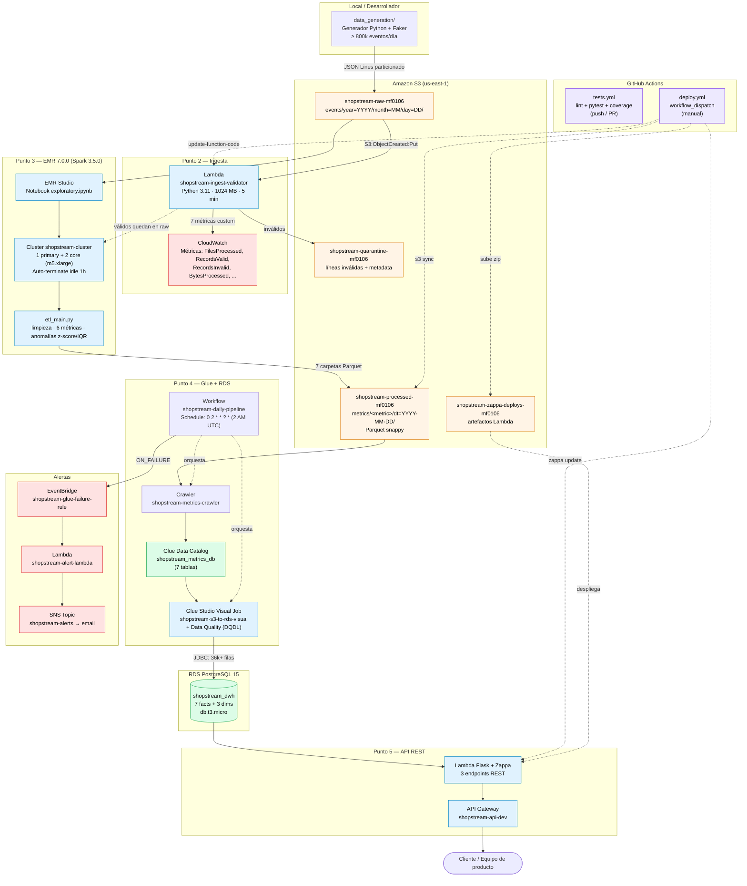

# Arquitectura — ShopStream Pipeline

Pipeline batch end-to-end en AWS Academy. El diagrama se renderiza automáticamente en GitHub gracias al soporte nativo de Mermaid.

## Diagrama de alto nivel

---

## Detalle por punto del parcial

### Punto 1 — Generación de datos

5 entidades relacionadas (`users`, `products`, `sessions`, `events`, `transactions`) con esquemas validados por `jsonschema`. El generador implementa:

- 70% mobile / 25% desktop / 5% tablet.
- Países sesgados (40% MX, 25% CO, 15% AR, 10% ES, 10% otros).
- Picos horarios 12-14h y 19-22h.
- Embudo realista: 100% page_view → 30% product_view → 8% cart → 3% transaction.
- ~25% sesiones bounce + ~0.5% sesiones anómalas intencionales (para validar Punto 3).
- Output JSON Lines particionado `events/year=YYYY/month=MM/day=DD/events_YYYY-MM-DD.jsonl`.

### Punto 2 — Ingesta + trigger

Trigger automático `s3:ObjectCreated:Put` sobre `events/*.jsonl`. La Lambda:

1. Streamea el archivo con `StreamingBody.iter_lines()` (no carga en memoria).
2. Valida cada línea contra el JSON Schema del tipo de evento.
3. Si `invalid_ratio >= 0.5` mueve el archivo completo a quarantine; si no, sólo las líneas inválidas con metadata `{error_reason, line_number, original_path}`.
4. Publica 7 métricas custom a CloudWatch namespace `ShopStream/Ingest`.

### Punto 3 — PySpark en EMR

- **Cluster**: EMR 7.0.0 (Spark 3.5.0, Python 3.9), 1 primary + 2 core m5.xlarge, auto-terminate idle 1h.
- **Limpieza**: dedup por `event_id` (window `row_number`), imputación de nulos (country → "UNKNOWN", time_on_page → mediana por page_type, device → moda por user), normalización (timestamps UTC ISO, URLs lowercase sin query strings, países ISO 3166).
- **6 métricas agregadas** → 6 carpetas Parquet particionadas por `dt`.
- **Anomalías**: z-score (|z| ≥ 3) + IQR (Q1−1.5·IQR, Q3+1.5·IQR) sobre 4 features de sesión. Sesión marcada si ≥ 2 indicadores la flaggean. Salida: `metrics/anomalies/dt=YYYY-MM-DD/`.

### Punto 4 — Glue + RDS

- **DWH**: 7 fact tables + 3 dim tables (`dim_date`, `dim_country`, `dim_device`).
- **Crawler** poblará la Glue Data Catalog `shopstream_metrics_db` (7 tablas).
- **Glue Studio Visual Job** con 4 nodos: Source (Glue Catalog) → Change Schema → **Data Quality (DQDL)** → Target (PostgreSQL JDBC).
- **Workflow**: schedule cron `0 2 * * ? *`, trigger `CRAWLER_SUCCEEDED → Job`, trigger `ON_FAILURE → Lambda alerta vía SNS email`.

### Punto 5 — API REST

3 endpoints expuestos vía API Gateway → Lambda (Flask + Zappa):

| Endpoint | Lógica |
|---|---|
| `GET /pages/top` | `SELECT page_url, value FROM fact_<metric> WHERE dt = :date ORDER BY value DESC LIMIT :n` |
| `GET /sessions/summary` | Agregado por `country` y/o `device` desde `fact_bounce_rate` + joins |
| `GET /anomalies` | `SELECT * FROM fact_anomalies WHERE dt = :date ORDER BY total_flags DESC, z_score DESC` |

Connection pooling con SQLAlchemy (`pool_pre_ping=True`, `pool_recycle=1800`).

---

## Decisiones de diseño

| Decisión | Justificación |
|---|---|
| 3 buckets S3 separados (raw / processed / quarantine) | Permite políticas IAM y lifecycle distintas por capa de datos. |
| Lambda de ingesta con streaming | Archivos de ~300 MB no caben en memoria si se cargan completos. |
| EMR cluster efímero (no Serverless) | Permite debuggear con notebook EMR Studio + step en el mismo cluster. EMR Serverless quedó documentado como alternativa. |
| Glue Studio visual (no sólo programático) | Requerido por el enunciado. El script `glue/glue_etl_job.py` se mantiene como respaldo y para validación local. |
| Zappa en vez de SAM/CDK | El enunciado lo pide explícitamente. Configuración con `manage_roles: false` para usar `LabRole`. |
| Deploy CD manual (`workflow_dispatch`) | Credenciales del Learner Lab caducan en 4h; un deploy automático en push fallaría con `ExpiredToken`. |
| `profile_name: null` en `zappa_settings.json` | Permite que Zappa funcione tanto local (vía `~/.aws/credentials`) como en CI (vía env vars de GitHub Actions). |
